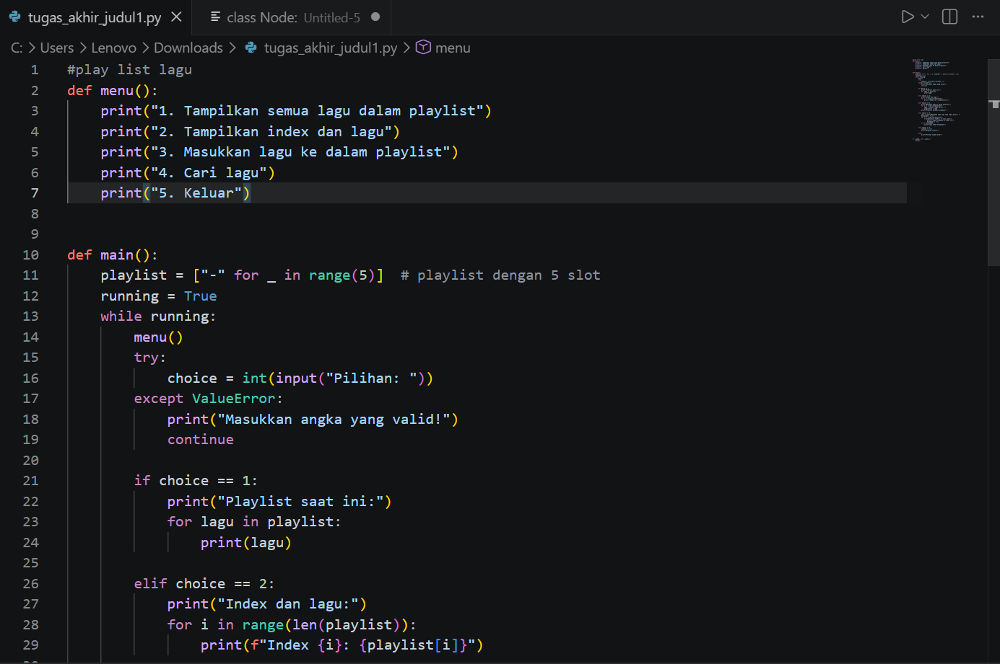
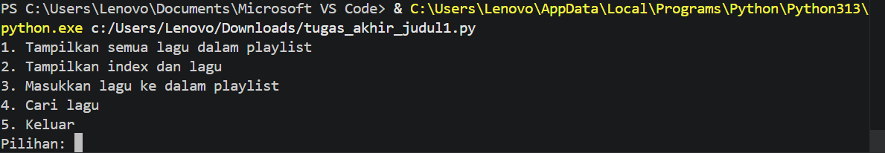

# Program Playlist Lagu

Program ini merupakan implementasi struktur data list dalam bahasa Python dengan konsep playlist lagu. Program dibuat menggunakan sistem menu interaktif sehingga pengguna dapat memilih berbagai fitur yang tersedia, seperti menampilkan daftar lagu, melihat index lagu, serta menambahkan lagu ke dalam playlist.

Selain itu, program ini juga memiliki fitur pencarian lagu yang memungkinkan pengguna mencari lagu berdasarkan nama. Program akan mengecek setiap data dalam list, kemudian menampilkan index lagu jika ditemukan, atau memberikan pesan jika lagu tidak tersedia. Program ini bertujuan untuk membantu memahami konsep dasar list, perulangan (looping), percabangan (if-else), serta interaksi input dan output dalam Python.

## Fitur

* Menampilkan semua lagu dalam playlist
* Menampilkan index dan isi lagu
* Menambahkan lagu ke dalam playlist
* Mencari lagu berdasarkan nama

  
  

