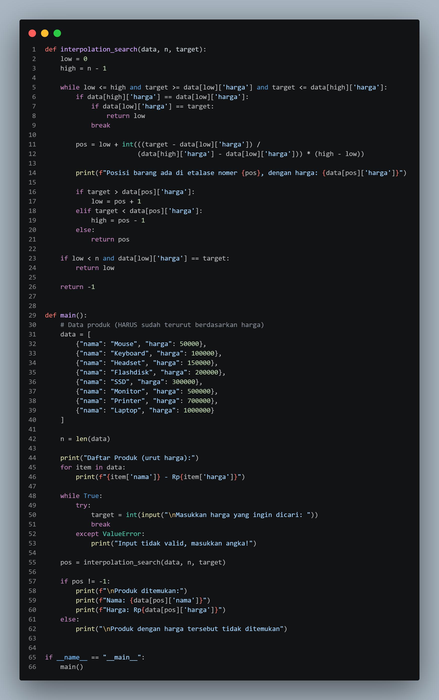

                      PROGRAM PENCARIAN PRODUK E-COMMERCE MENGGUNAKAN INTERPOLATION SEARCH
Program ini merupakan program pencarian produk pada sistem e-commerce menggunakan algoritma interpolation search. Program menyimpan data produk berupa nama dan harga yang sudah diurutkan berdasarkan harga. Pengguna dapat memasukkan harga produk yang ingin dicari, kemudian program akan memperkirakan posisi data menggunakan perhitungan interpolation search agar proses pencarian menjadi lebih cepat dan efisien dibanding pencarian biasa.
Pada program ini, jika harga produk ditemukan maka sistem akan menampilkan nama produk beserta harganya. Namun jika harga yang dicari tidak tersedia, program akan menampilkan pesan bahwa produk tidak ditemukan. Program ini cocok digunakan dalam sistem e-commerce karena mampu membantu proses pencarian produk berdasarkan harga dengan lebih cepat pada data yang sudah terurut.

