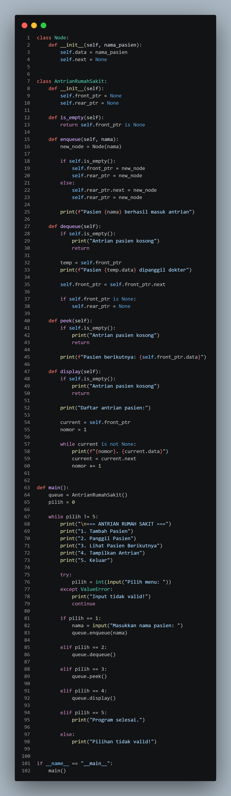

                                     SISTEM ANTRIAN RUMAH SAKIT
Program ini merupakan implementasi struktur data queue (antrian) menggunakan linked list dalam bentuk sistem antrian rumah sakit. Program digunakan untuk mengatur pasien yang masuk ke dalam antrian berdasarkan konsep FIFO (First In First Out), yaitu pasien yang datang lebih dahulu akan dipanggil lebih dahulu. Setiap pasien disimpan dalam node yang saling terhubung melalui pointer next, sehingga data dapat bertambah secara dinamis tanpa batas ukuran tetap seperti array.

Program memiliki beberapa fitur utama, yaitu menambahkan pasien ke antrian (enqueue), memanggil pasien terdepan (dequeue), melihat pasien berikutnya (peek), dan menampilkan seluruh daftar antrian (display). Selain itu, program juga menggunakan menu interaktif agar pengguna dapat memilih operasi yang diinginkan. Dengan menggunakan linked list, proses penambahan dan penghapusan pasien menjadi lebih efisien karena tidak memerlukan pergeseran data seperti pada queue berbasis array.

           penjelasan code
class Node:

Mendefinisikan class Node sebagai elemen dasar pada struktur linked list. Setiap node digunakan untuk menyimpan data pasien dan referensi ke node berikutnya.

def __init__(self, nama_pasien):

Constructor pada class Node yang dijalankan secara otomatis ketika objek node dibuat. Parameter nama_pasien digunakan untuk menerima data pasien.

self.data = nama_pasien

Menyimpan nilai nama pasien ke dalam atribut data pada node.

self.next = None

Menginisialisasi pointer next dengan nilai None, menandakan bahwa node belum terhubung dengan node lain.

class AntrianRumahSakit:

Mendefinisikan class utama yang digunakan untuk mengelola sistem queue atau antrian rumah sakit berbasis linked list.

def __init__(self):

Constructor class AntrianRumahSakit yang digunakan untuk menginisialisasi queue.

self.front_ptr = None

Pointer front_ptr digunakan untuk menunjuk node paling depan dalam queue. Nilai awal None menandakan queue masih kosong.

self.rear_ptr = None

Pointer rear_ptr digunakan untuk menunjuk node paling belakang dalam queue. Nilai awal None menunjukkan belum ada data pada queue.

def is_empty(self):

Method untuk memeriksa apakah queue dalam kondisi kosong.

return self.front_ptr is None

Mengembalikan nilai True apabila queue kosong dan False apabila queue memiliki data.

def enqueue(self, nama):

Method yang digunakan untuk menambahkan pasien baru ke dalam antrian.

new_node = Node(nama)

Membuat objek node baru berdasarkan data pasien yang diterima.

if self.is_empty():

Melakukan pengecekan apakah queue masih kosong.

self.front_ptr = new_node

Jika queue kosong, node baru dijadikan sebagai elemen paling depan.

self.rear_ptr = new_node

Karena hanya terdapat satu data, node baru juga dijadikan sebagai elemen paling belakang.

else:

Menjalankan blok kode apabila queue sudah memiliki data sebelumnya.

self.rear_ptr.next = new_node

Menghubungkan node terakhir dengan node baru menggunakan pointer next.

self.rear_ptr = new_node

Memperbarui posisi rear_ptr agar menunjuk node terbaru pada queue.

print(f"Pasien {nama} berhasil masuk antrian")

Menampilkan informasi bahwa pasien berhasil ditambahkan ke dalam antrian.

def dequeue(self):

Method yang digunakan untuk menghapus pasien paling depan dari queue.

if self.is_empty():

Melakukan pengecekan apakah queue kosong sebelum proses penghapusan dilakukan.

print("Antrian pasien kosong")

Menampilkan pesan apabila tidak terdapat data pasien dalam queue.

return

Menghentikan proses method karena tidak ada data yang dapat dihapus.

temp = self.front_ptr

Menyimpan node paling depan ke variabel sementara untuk digunakan pada proses output.

print(f"Pasien {temp.data} dipanggil dokter")

Menampilkan nama pasien yang dipanggil dari posisi paling depan queue.

self.front_ptr = self.front_ptr.next

Memindahkan pointer depan ke node berikutnya sehingga node sebelumnya keluar dari queue.

if self.front_ptr is None:

Memeriksa apakah queue menjadi kosong setelah proses dequeue dilakukan.

self.rear_ptr = None

Mengosongkan pointer belakang apabila seluruh data telah habis.

def peek(self):

Method yang digunakan untuk melihat data pasien paling depan tanpa menghapusnya dari queue.

if self.is_empty():

Melakukan pengecekan apakah queue kosong.

print("Antrian pasien kosong")

Menampilkan pesan apabila tidak ada data pasien dalam queue.

return

Menghentikan proses method.

print(f"Pasien berikutnya: {self.front_ptr.data}")

Menampilkan nama pasien yang berada di posisi paling depan queue.

def display(self):

Method yang digunakan untuk menampilkan seluruh data pasien dalam queue.

if self.is_empty():

Melakukan pengecekan apakah queue kosong.

print("Antrian pasien kosong")

Menampilkan pesan apabila queue tidak memiliki data.

return

Menghentikan proses method karena tidak ada data yang dapat ditampilkan.

print("Daftar antrian pasien:")

Menampilkan judul daftar antrian pasien.

current = self.front_ptr

Variabel current digunakan untuk traversal atau penelusuran linked list dimulai dari node paling depan.

nomor = 1

Variabel penghitung untuk nomor urut pasien.

while current is not None:

Melakukan iterasi selama masih terdapat node pada linked list.

print(f"{nomor}. {current.data}")

Menampilkan nomor urut dan nama pasien dalam queue.

current = current.next

Memindahkan traversal ke node berikutnya.

nomor += 1

Menambahkan nilai nomor urut setiap iterasi berlangsung.

def main():

Mendefinisikan fungsi utama program.

queue = AntrianRumahSakit()

Membuat objek queue berdasarkan class AntrianRumahSakit.

pilih = 0

Variabel untuk menyimpan pilihan menu dari pengguna.

while pilih != 5:

Perulangan program akan terus berjalan hingga pengguna memilih menu keluar.

print("\n=== ANTRIAN RUMAH SAKIT ===")

Menampilkan judul menu program.

print("1. Tambah Pasien")

Menampilkan menu untuk menambahkan pasien.

print("2. Panggil Pasien")

Menampilkan menu untuk memanggil pasien.

print("3. Lihat Pasien Berikutnya")

Menampilkan menu untuk melihat pasien berikutnya.

print("4. Tampilkan Antrian")

Menampilkan menu untuk melihat seluruh antrian.

print("5. Keluar")

Menampilkan menu untuk keluar dari program.

try:

Blok penanganan error untuk mencegah kesalahan input.

pilih = int(input("Pilih menu: "))

Menerima input pilihan menu dari pengguna dalam bentuk integer.

except ValueError:

Menangani error apabila input bukan angka.

print("Input tidak valid!")

Menampilkan pesan kesalahan input.

continue

Mengulangi perulangan menu utama.

if pilih == 1:

Menjalankan proses penambahan pasien apabila pengguna memilih menu 1.

nama = input("Masukkan nama pasien: ")

Menerima input nama pasien.

queue.enqueue(nama)

Menambahkan pasien ke queue menggunakan method enqueue.

elif pilih == 2:

Menjalankan proses pemanggilan pasien apabila pengguna memilih menu 2.

queue.dequeue()

Menghapus pasien paling depan dari queue menggunakan method dequeue.

elif pilih == 3:

Menjalankan proses melihat pasien berikutnya apabila pengguna memilih menu 3.

queue.peek()

Menampilkan pasien paling depan menggunakan method peek.

elif pilih == 4:

Menjalankan proses menampilkan seluruh antrian apabila pengguna memilih menu 4.

queue.display()

Menampilkan seluruh isi queue menggunakan method display.

elif pilih == 5:

Menjalankan proses keluar program apabila pengguna memilih menu 5.

print("Program selesai.")

Menampilkan pesan penutup program.

else:

Menangani kondisi apabila pengguna memasukkan pilihan menu yang tidak tersedia.

print("Pilihan tidak valid!")

Menampilkan pesan kesalahan pilihan menu.

if __name__ == "__main__":

Mengecek apakah file Python dijalankan secara langsung sebagai program utama.

main()

Menjalankan fungsi main() sebagai titik awal eksekusi program.

        penjelasan output
