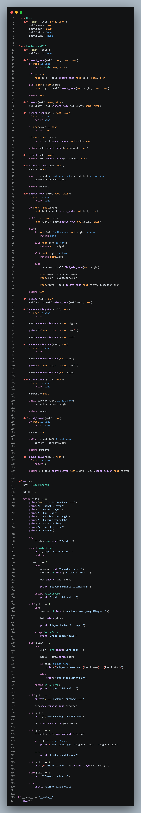
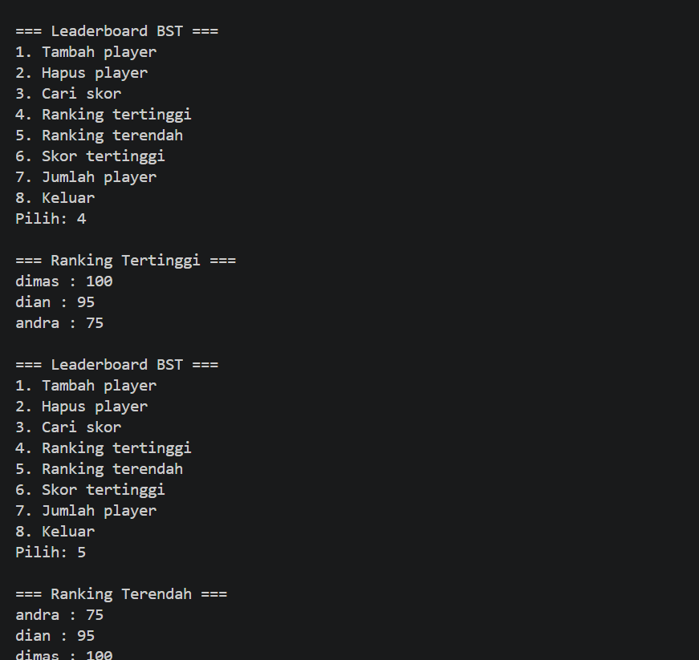

                                           SISTEM RANKING LEADERBOARD
Sistem leaderboard menggunakan Binary Search Tree (BST) adalah sistem yang digunakan untuk menyimpan dan mengelola data pemain beserta skor mereka dalam bentuk struktur pohon biner terurut. Pada sistem ini setiap node menyimpan nama pemain, skor, serta pointer ke child kiri dan kanan. Aturan BST diterapkan berdasarkan skor, yaitu jika skor lebih kecil maka data ditempatkan di subtree kiri, sedangkan jika skor lebih besar ditempatkan di subtree kanan. Dengan konsep ini proses pencarian, penambahan, dan penghapusan data dapat dilakukan lebih cepat dibanding pencarian linear biasa.

Sistem ini memiliki beberapa fitur utama seperti menambahkan player baru, menghapus player, mencari skor tertentu, menampilkan ranking tertinggi maupun terendah, mencari skor tertinggi, dan menghitung jumlah player. Traversal BST juga digunakan untuk menampilkan ranking secara terurut. Traversal dari kanan ke kiri menghasilkan ranking tertinggi terlebih dahulu, sedangkan traversal kiri ke kanan menghasilkan ranking terendah terlebih dahulu. Sistem ini cocok digunakan pada game, leaderboard kompetisi, sistem ranking turnamen, maupun aplikasi penilaian lainnya.

class Node:
Membuat class Node sebagai tempat penyimpanan data player dalam BST.

def init(self, nama, skor):
Constructor yang dijalankan saat object Node dibuat.

self.nama = nama
Menyimpan nama player ke dalam node.

self.skor = skor
Menyimpan skor player.

self.left = None
Pointer child kiri, awalnya kosong.

self.right = None
Pointer child kanan, awalnya kosong.

class LeaderboardBST:
Class utama untuk mengelola BST leaderboard.

def init(self):
Constructor BST.

self.root = None
Root BST awalnya kosong.

def insert_node(self, root, nama, skor):
Function rekursif untuk memasukkan node baru.

if root is None:
Jika posisi kosong ditemukan.

return Node(nama, skor)
Membuat node baru.

if skor < root.skor:
Jika skor lebih kecil dari root.

root.left = self.insert_node(root.left, nama, skor)
Masuk ke subtree kiri.

elif skor > root.skor:
Jika skor lebih besar dari root.

root.right = self.insert_node(root.right, nama, skor)
Masuk ke subtree kanan.

return root
Mengembalikan root setelah insert selesai.

def insert(self, nama, skor):
Function utama insert.

self.root = self.insert_node(self.root, nama, skor)
Memulai insert dari root BST.

def search_score(self, root, skor):
Function rekursif mencari skor.

if root is None:
Jika node kosong.

return None
Skor tidak ditemukan.

if root.skor == skor:
Jika skor sama dengan yang dicari.

return root
Mengembalikan node yang ditemukan.

if skor < root.skor:
Jika skor lebih kecil.

return self.search_score(root.left, skor)
Cari ke kiri.

return self.search_score(root.right, skor)
Cari ke kanan.

def search(self, skor):
Function utama search.

return self.search_score(self.root, skor)
Mulai pencarian dari root.

def find_min_node(self, root):
Mencari node dengan skor terkecil.

current = root
Pointer traversal sementara.

while current is not None and current.left is not None:
Selama masih ada child kiri.

current = current.left
Terus bergerak ke kiri.

return current
Mengembalikan node terkecil.

def delete_node(self, root, skor):
Function rekursif menghapus node.

if root is None:
Jika tree kosong.

return None
Tidak ada yang dihapus.

if skor < root.skor:
Jika skor lebih kecil.

root.left = self.delete_node(root.left, skor)
Hapus di subtree kiri.

elif skor > root.skor:
Jika skor lebih besar.

root.right = self.delete_node(root.right, skor)
Hapus di subtree kanan.

else:
Jika node ditemukan.

if root.left is None and root.right is None:
Node tidak punya child.

return None
Node langsung dihapus.

elif root.left is None:
Hanya punya child kanan.

return root.right
Node diganti child kanan.

elif root.right is None:
Hanya punya child kiri.

return root.left
Node diganti child kiri.

else:
Jika punya dua child.

successor = self.find_min_node(root.right)
Cari successor.

root.nama = successor.nama
Ganti nama node.

root.skor = successor.skor
Ganti skor node.

root.right = self.delete_node(root.right, successor.skor)
Hapus successor asli.

return root
Mengembalikan root.

def delete(self, skor):
Function utama delete.

self.root = self.delete_node(self.root, skor)
Mulai delete dari root.

def show_ranking_desc(self, root):
Menampilkan ranking tertinggi ke terendah.

if root is None:
Jika tree kosong.

return
Hentikan function.

self.show_ranking_desc(root.right)
Traversal kanan dulu.

print(f"{root.nama} : {root.skor}")
Menampilkan nama dan skor.

self.show_ranking_desc(root.left)
Traversal kiri.

def show_ranking_asc(self, root):
Menampilkan ranking terendah ke tertinggi.

self.show_ranking_asc(root.left)
Traversal kiri dulu.

print(f"{root.nama} : {root.skor}")
Cetak data player.

self.show_ranking_asc(root.right)
Traversal kanan.

def find_highest(self, root):
Mencari skor tertinggi.

if root is None:
Jika tree kosong.

return None
Tidak ada data.

current = root
Pointer traversal.

while current.right is not None:
Selama masih ada child kanan.

current = current.right
Bergerak ke kanan.

return current
Mengembalikan skor tertinggi.

def count_player(self, root):
Menghitung jumlah player.

if root is None:
Jika tree kosong.

return 0
Jumlah = 0.

return 1 + self.count_player(root.left) + self.count_player(root.right)
Menjumlahkan seluruh node.

def main():
Function utama program.

bst = LeaderboardBST()
Membuat object BST leaderboard.

pilih = 0
Variabel menu.

while pilih != 8:
Loop program sampai keluar.

print("1. Tambah player")
Menampilkan menu tambah player.

print("2. Hapus player")
Menu hapus player.

print("3. Cari skor")
Menu cari skor.

print("4. Ranking tertinggi")
Menu ranking descending.

print("5. Ranking terendah")
Menu ranking ascending.

print("6. Skor tertinggi")
Menu skor tertinggi.

print("7. Jumlah player")
Menu jumlah player.

print("8. Keluar")
Menu keluar.

pilih = int(input("Pilih: "))
Input pilihan menu.

nama = input("Masukkan nama: ")
Input nama player.

skor = int(input("Masukkan skor: "))
Input skor player.

bst.insert(nama, skor)
Menambahkan player ke BST.

hasil = bst.search(skor)
Mencari skor player.

bst.show_ranking_desc(bst.root)
Menampilkan ranking tertinggi.

bst.show_ranking_asc(bst.root)
Menampilkan ranking terendah.

highest = bst.find_highest(bst.root)
Mencari skor tertinggi.

bst.count_player(bst.root)
Menghitung jumlah player.

if name == "main":
Mengecek apakah file dijalankan langsung.

main()
Menjalankan program utama.

Output sistem berupa menu interaktif leaderboard yang berjalan di terminal atau console. User dapat menambahkan player beserta skor, mencari skor tertentu, melihat ranking dari tertinggi maupun terendah, menghapus player, melihat skor tertinggi, dan menghitung jumlah player yang tersimpan dalam BST. Semua data disimpan dalam bentuk struktur Binary Search Tree sehingga data selalu tersusun otomatis berdasarkan skor.

Fungsi utama sistem ini adalah untuk mengelola data ranking secara cepat dan terurut menggunakan konsep Binary Search Tree. Sistem memanfaatkan traversal BST untuk menampilkan ranking dan menggunakan operasi insert, delete, serta search untuk mempermudah pengelolaan leaderboard. Implementasi seperti ini umum digunakan pada game online, turnamen, sistem nilai, dan aplikasi yang membutuhkan pengurutan skor secara otomatis.
