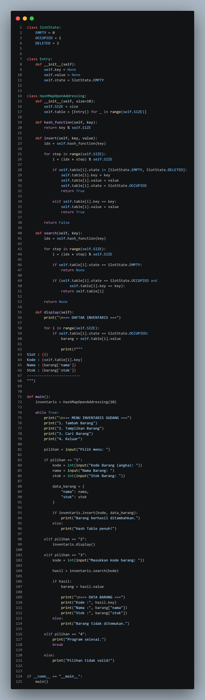
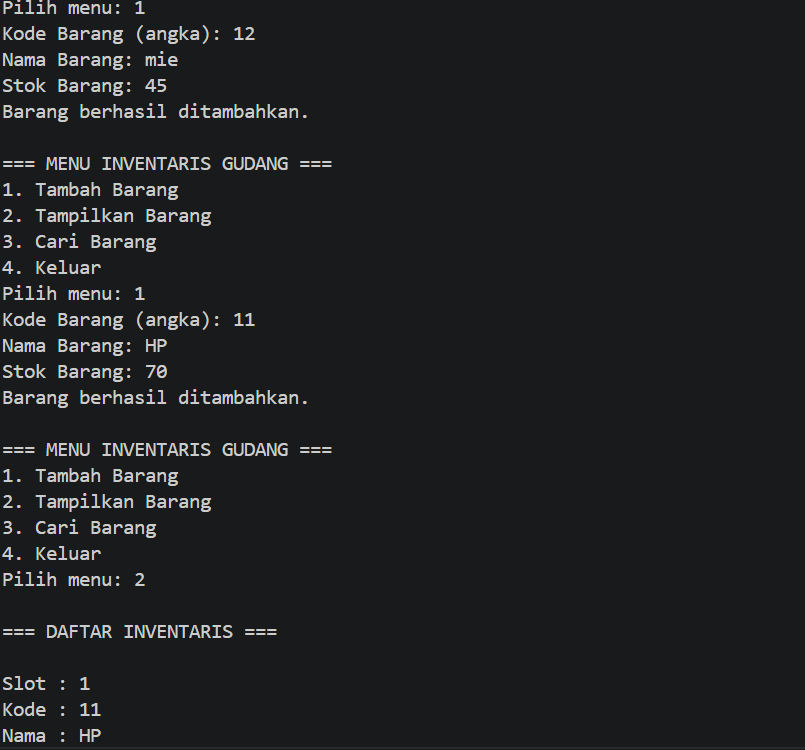

                                     SISTEM INVENTARIS GUDANG
Sistem ini merupakan implementasi Hash Map dengan metode open addressing untuk menyimpan data inventaris gudang secara efisien. Setiap barang disimpan menggunakan pasangan key dan value, di mana key berupa kode barang dan value berupa data seperti nama dan stok. Posisi penyimpanan ditentukan menggunakan fungsi hash sederhana yaitu key % ukuran tabel, sehingga setiap data langsung diarahkan ke indeks tertentu di dalam array. Tujuan utama penggunaan hash table ini adalah mempercepat proses pencarian, penambahan, dan pengelolaan data dibandingkan struktur data seperti list biasa.

Ketika terjadi collision atau dua key menghasilkan indeks yang sama, sistem ini menggunakan metode linear probing. Artinya, jika slot yang dituju sudah terisi, maka program akan mencari slot berikutnya secara berurutan dengan rumus (idx + step) % SIZE sampai menemukan slot kosong atau slot yang bisa diperbarui. Selain itu, sistem juga memiliki status slot seperti EMPTY, OCCUPIED, dan DELETED untuk mengatur kondisi setiap posisi di tabel. Dengan mekanisme ini, data tetap bisa disimpan dan dicari meskipun terjadi tabrakan indeks.
class SlotState:
Baris ini membuat sebuah class bernama SlotState. Class ini tidak digunakan untuk membuat objek, tetapi hanya sebagai tempat menyimpan konstanta status slot pada hash table.

EMPTY = 0
Menandakan slot masih kosong dan belum pernah digunakan.

OCCUPIED = 1
Menandakan slot sedang berisi data.

DELETED = 2
Menandakan slot pernah berisi data tetapi sudah dihapus.

class Entry:
Membuat class Entry yang digunakan sebagai wadah data pada setiap slot hash table.

def init(self):
Constructor yang akan dijalankan otomatis saat objek Entry dibuat.

self.key = None
Menyimpan key atau kode barang. Nilai awalnya None karena belum ada data.

self.value = None
Menyimpan isi data barang. Nilai awalnya None.

self.state = SlotState.EMPTY
Menandakan bahwa slot baru dibuat dalam keadaan kosong.

class HashMapOpenAddressing:
Membuat class utama yang mengimplementasikan Hash Table menggunakan metode Open Addressing dengan Linear Probing.

def init(self, size=10):
Constructor HashMapOpenAddressing. Parameter size menentukan jumlah slot yang tersedia, dengan nilai default 10.

self.SIZE = size
Menyimpan ukuran hash table ke dalam atribut SIZE.

self.table = [Entry() for _ in range(self.SIZE)]
Membuat list berisi objek Entry sebanyak SIZE buah. Jika SIZE = 10 maka akan dibuat 10 slot kosong.

def hash_function(self, key):
Membuat fungsi hash untuk menentukan posisi awal suatu key.

return key % self.SIZE
Menghasilkan indeks menggunakan operasi modulus.

Contoh:
Jika key = 25 dan SIZE = 10

25 % 10 = 5

Maka posisi awal data berada pada indeks 5.

Jika key = 11

11 % 10 = 1

Jika key = 21

21 % 10 = 1

Karena menghasilkan indeks yang sama maka terjadi collision.

def insert(self, key, value):
Digunakan untuk memasukkan data ke hash table.

idx = self.hash_function(key)
Menghitung posisi awal berdasarkan fungsi hash.

Misalnya key = 25

idx = 25 % 10
idx = 5

for step in range(self.SIZE):
Melakukan pencarian slot sebanyak jumlah slot yang tersedia.

Jika SIZE = 10 maka step akan bernilai:

0, 1, 2, 3, 4, 5, 6, 7, 8, 9

i = (idx + step) % self.SIZE
Rumus Linear Probing yang digunakan untuk mencari slot kosong berikutnya jika terjadi collision.

Misalnya:

idx = 5
SIZE = 10

Saat step = 0

i = (5 + 0) % 10
i = 5

Saat step = 1

i = (5 + 1) % 10
i = 6

Saat step = 2

i = (5 + 2) % 10
i = 7

Saat step = 3

i = (5 + 3) % 10
i = 8

Jika sudah mencapai ujung tabel:

idx = 8
step = 3

i = (8 + 3) % 10
i = 11 % 10
i = 1

Sehingga pencarian akan berputar kembali ke awal tabel.

if self.table[i].state in [SlotState.EMPTY, SlotState.DELETED]:
Mengecek apakah slot kosong atau sudah dihapus. Jika iya maka slot dapat digunakan.

self.table[i].key = key
Menyimpan key pada slot tersebut.

self.table[i].value = value
Menyimpan data barang.

self.table[i].state = SlotState.OCCUPIED
Mengubah status slot menjadi terisi.

return True
Menandakan proses penyimpanan berhasil.

elif self.table[i].key == key:
Jika key yang sama sudah ada di hash table.

self.table[i].value = value
Data lama diperbarui dengan data baru.

return True
Menandakan update berhasil.

return False
Jika semua slot sudah penuh dan tidak ada tempat lagi untuk menyimpan data.

def search(self, key):
Digunakan untuk mencari data berdasarkan key.

idx = self.hash_function(key)
Menghitung posisi awal berdasarkan fungsi hash.

for step in range(self.SIZE):
Melakukan pencarian dengan pola Linear Probing yang sama seperti saat insert.

i = (idx + step) % self.SIZE
Menghasilkan indeks yang akan diperiksa.

if self.table[i].state == SlotState.EMPTY:
Jika ditemukan slot kosong maka pencarian dihentikan.

Alasannya karena jika saat insert data tidak pernah melewati slot kosong, maka data yang dicari pasti tidak ada.

return None
Mengembalikan nilai None karena data tidak ditemukan.

if (self.table[i].state == SlotState.OCCUPIED and self.table[i].key == key):
Mengecek apakah slot berisi data dan key sesuai dengan yang dicari.

return self.table[i]
Mengembalikan objek Entry yang ditemukan.

return None
Jika seluruh tabel sudah diperiksa tetapi data tidak ditemukan.

def display(self):
Digunakan untuk menampilkan semua data inventaris.

print("\n=== DAFTAR INVENTARIS ===")
Menampilkan judul daftar inventaris.

for i in range(self.SIZE):
Melakukan perulangan untuk memeriksa semua slot.

if self.table[i].state == SlotState.OCCUPIED:
Hanya menampilkan slot yang berisi data.

barang = self.table[i].value
Mengambil data barang dari slot.

print(...)
Menampilkan nomor slot, kode barang, nama barang, dan stok barang.

def main():
Merupakan fungsi utama yang mengendalikan seluruh program.

inventaris = HashMapOpenAddressing(10)
Membuat hash table dengan kapasitas 10 slot.

while True:
Membuat menu yang terus berulang sampai pengguna memilih keluar.

print(...)
Menampilkan daftar menu.

pilihan = input("Pilih menu: ")
Membaca pilihan pengguna.

Jika pilihan == "1"

kode = int(input("Kode Barang (angka): "))
Meminta kode barang.

nama = input("Nama Barang: ")
Meminta nama barang.

stok = int(input("Stok Barang: "))
Meminta jumlah stok.

data_barang = {"nama": nama, "stok": stok}
Menyimpan data barang dalam dictionary.

inventaris.insert(kode, data_barang)
Memasukkan data ke hash table.

Jika pilihan == "2"

inventaris.display()
Menampilkan semua data inventaris.

Jika pilihan == "3"

kode = int(input("Masukkan kode barang: "))
Meminta kode barang yang ingin dicari.

hasil = inventaris.search(kode)
Mencari data barang.

Jika hasil ditemukan:

barang = hasil.value
Mengambil data barang.

print("Kode :", hasil.key)
print("Nama :", barang["nama"])
print("Stok :", barang["stok"])
Menampilkan data barang.

Jika tidak ditemukan:

print("Barang tidak ditemukan.")
Menampilkan pesan bahwa data tidak ada.

Jika pilihan == "4"

print("Program selesai.")
Menampilkan pesan selesai.

break
Menghentikan perulangan dan keluar dari program.

if name == "main":
Mengecek apakah file dijalankan langsung oleh Python.

Output dari sistem ini berupa tampilan menu interaktif di terminal yang memungkinkan pengguna menambah barang, menampilkan seluruh data inventaris, dan mencari barang berdasarkan kode. Saat menampilkan data, sistem akan menunjukkan slot penyimpanan, kode barang, nama barang, dan stok yang tersimpan. Kegunaan sistem ini adalah untuk membantu pengelolaan inventaris gudang sederhana agar lebih cepat dan terstruktur, terutama dalam pencarian data barang secara efisien tanpa harus mengecek satu per satu seperti pada list biasa.

main()
Menjalankan fungsi utama program.
